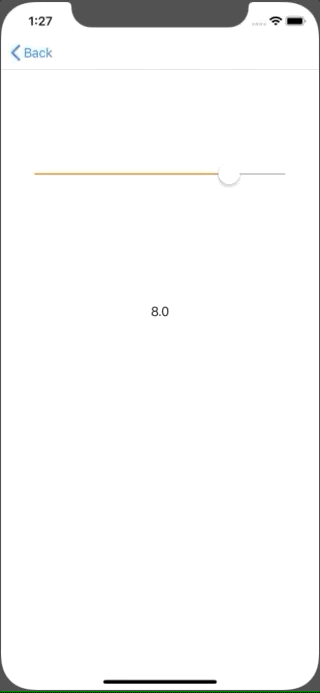

+++
title = "Getting a value with UISlider (Swift5.0)"
url = "2019-06-01"
date = "2019-06-01"
description = "Getting a value with UISlider (Swift5.0)"
tags = [
    "iOS",
]
categories = [
    "iOS",
]
archives = "2019/06"
aliases = ["migrate-from-jekyl"]
+++

 

This is the sample code to get the value with UISlider.
You can take any value in between by setting a minimum and maximum value.

<!-- Google Ads -->


<!-- Amazon Ads -->



