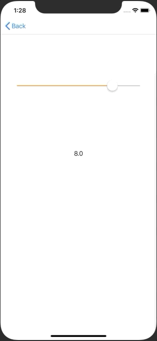

+++
title = "Using UISlider to retrieve a value at regular intervals (Swift5.0)"
url = "2019-06-02"
date = "2019-06-02"
description = "Using UISlider to retrieve a value at regular intervals (Swift5.0)"
tags = [
    "iOS",
]
categories = [
    "Swift",
    "iOS",
]
archives = "2019/06"
aliases = ["migrate-from-jekyl"]
+++

 

0, 0.5, 1.0, 1.5 ..... The following is a sample code to get the value at regular intervals of 0, 0, 5, 1, 0, 1, 1, 0, 1, 1, 5, and so on with UISlider.

<!-- Google Ads -->


<!-- Amazon Ads -->



