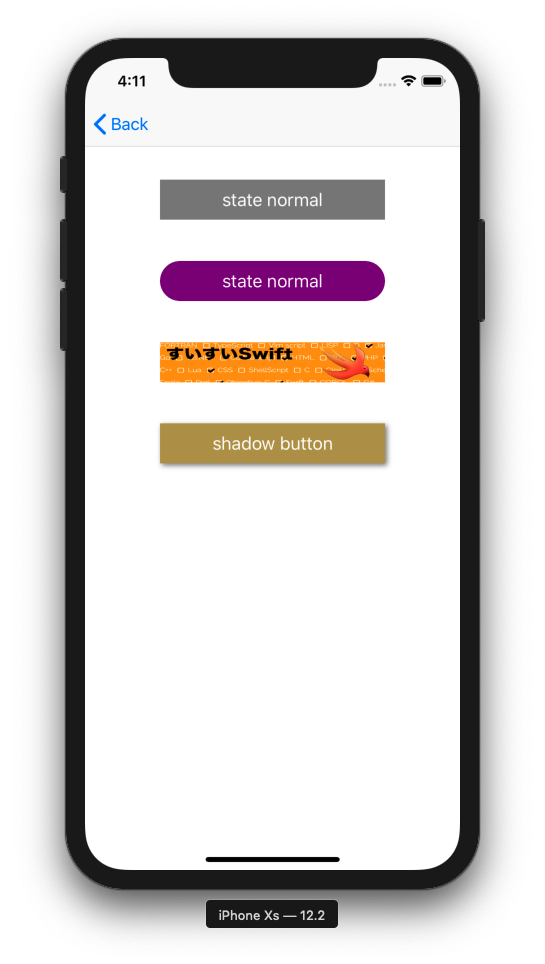

+++
title = "UIButton, display a button (Swift5.0)"
url = "2019-06-03"
date = "2019-06-03"
description = "UIButton, display a button (Swift5.0)"
tags = [
    "iOS",
]
categories = [
    "iOS",
]
archives = "2019/06"
aliases = ["migrate-from-jekyl"]
+++

 

This is a sample code to display a button using UIButton.
I use the rounded corner buttons a lot.

 



 

<!-- Google Ads -->


<!-- Amazon Ads -->

