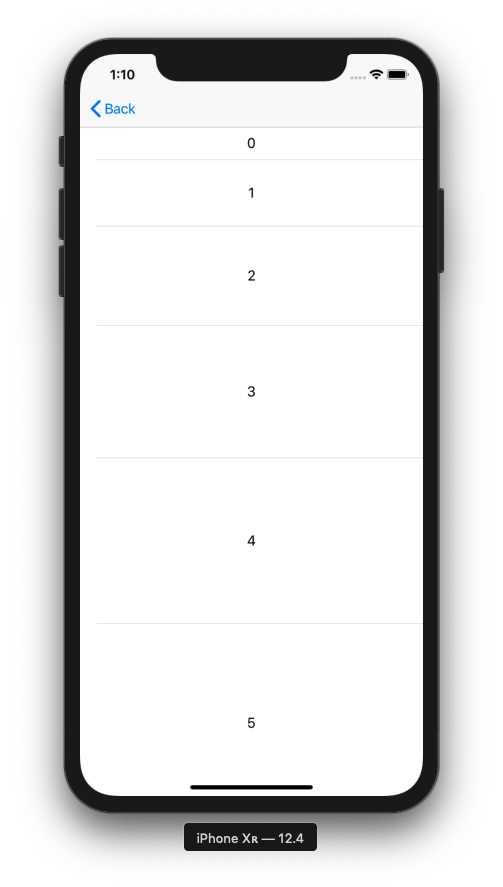

+++
title = "Changing the height of a TableView cell (Swift5.0.1)"
url = "2019-07-30"
date = "2019-07-30"
description = "Changing the height of a TableView cell (Swift5.0.1)"
tags = [
    "iOS",
    "Swift5",
]
categories = [
    "Swift",
    "iOS",
]
archives = "2019/07"
aliases = ["migrate-from-jekyl"]
+++

 

This is how to change the height of a cell in TableView.  
I was able to achieve this by using .rowHeight for batch return and heightForRowAt for individual changes.

[https://github.com/takoikatakotako/swiswiswift-ios](https://github.com/takoikatakotako/swiswiswift-ios)

<!-- Google Ads -->


<!-- Amazon Ads -->


 


