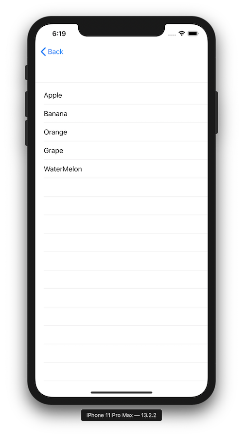

+++
title =  "Displaying a List in SwiftUI"
url = "2019-11-13"
date = "2019-11-13"
description = "Displaying a List in SwiftUI"
tags = [
    "iOS", "Swift"
]
categories = [
    "iOS", "Swift"
]
archives = "2019/11"
aliases = ["migrate-from-jekyl"]
+++

 

Here's how to display a list in SwiftUI.
Since this is the screen after the screen transition, there is a NavigationBar.

<!-- Google Ads -->


<!-- Amazon Ads -->



