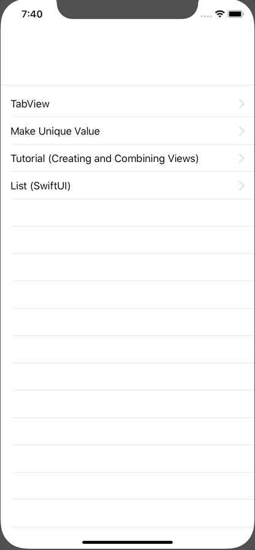

+++
title =  "Transition from one ListView to another (SwiftUI)"
url = "2019-11-20"
date = "2019-11-20"
description = "Transition from one ListView to another (SwiftUI)"
tags = [
    "iOS", "Swift", "SwiftUI"
]
categories = [
    "iOS", "Swift", "SwiftUI"
]
archives = "2019/11"
aliases = ["migrate-from-jekyl"]
+++

 

It was a bit of a hassle to transition from one ListView to another like the configuration screen.  
I feel like there's a better way to do it.

<!-- Google Ads -->


<!-- Amazon Ads -->



