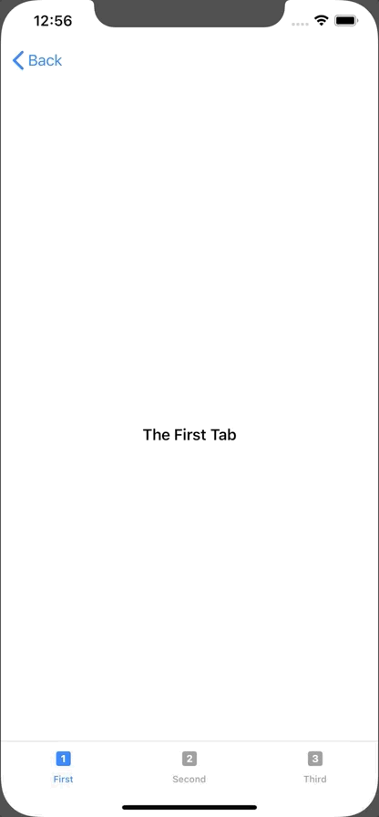

+++
title =  "Using TabView to switch screens (SwiftUI)"
url = "2019-11-21"
date = "2019-11-21"
description = "Using TabView to switch screens (SwiftUI)"
tags = [
    "iOS", "Swift", "SwiftUI"
]
categories = [
    "iOS", "Swift", "SwiftUI"
]
archives = "2019/11"
aliases = ["migrate-from-jekyl"]
+++

 

Here's a sample of how to switch screens using TabView.
It's pretty easy to write about, isn't it?

[TabView - SwiftUI | Apple Developer Documentation](https://developer.apple.com/documentation/swiftui/tabview)

<!-- Google Ads -->


<!-- Amazon Ads -->



