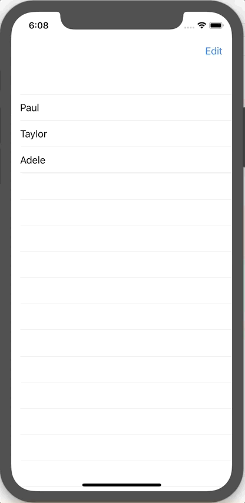

+++
title =  "Editing a List in SwiftUI"
url = "2019-12-17"
date = "2019-12-17"
description = "Editing a List in SwiftUI"
tags = [
    "SwiftUI"
]
categories = [
    "SwiftUI"
]
archives = "2019/12"
aliases = ["migrate-from-jekyl"]
+++

 

Here's how to edit a list in SwiftUI.
I was able to write shorter code than UITableView.

Reference: [How to enable editing on a list using EditButton](https://www.hackingwithswift.com/quick-start/swiftui/how-to-enable-editing-on-a-list-using-editbutton)

<!-- Google Ads -->


<!-- Amazon Ads -->



