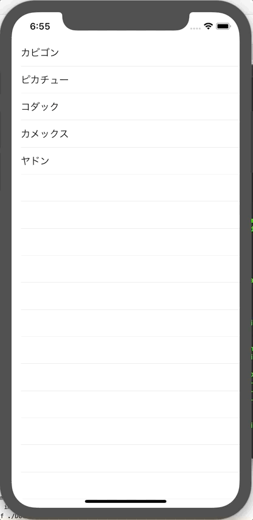

+++
title =  "How to get an alert when you tap a cell in a list in SwiftUI"
url = "2019-12-18"
date = "2019-12-18"
description = "How to get an alert when you tap a cell in a list in SwiftUI"
tags = [
    "SwiftUI"
]
categories = [
    "SwiftUI"
]
archives = "2019/12"
aliases = ["migrate-from-jekyl"]
+++

 

How to get an alert when you tap a cell in a list in SwiftUI.
I still haven't gotten used to SwiftUI yet.

<!-- Google Ads -->


<!-- Amazon Ads -->



