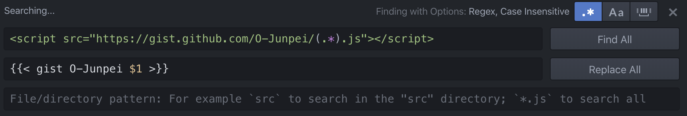

+++
title =  "Gist doesn't show up in Hugo"
url = "2019-12-28"
date = "2019-12-28"
description = "Gist doesn't show up in Hugo"
tags = [
    "Hugo"
]
categories = [
    "Hugo"
]
archives = "2019/12"
aliases = ["migrate-from-jekyl"]
+++

<br>

When I updated the version of Hugo, I no longer see the following Gist page.

```
<script src="https://gist.github.com/takoikatakotako/5aba51305d74c009a2c878897837e006.js"></script>
```

It worked by rewriting it as follows.


Reference: [Shortcodes](https://gohugo.io/content-management/shortcodes/)

<!-- Google Ads -->


<!-- Amazon Ads -->


I used Atom's regular expression substitution function to do the substitution in bulk.


