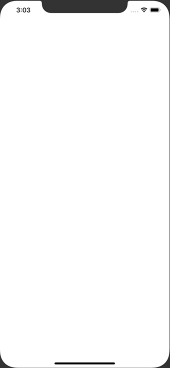

+++
title =  "Sample apps using MVP architecture"
url = "2019-12-30"
date = "2019-12-30"
description = "Sample apps using MVP architecture"
tags = [
    "Swift"
]
categories = [
    "Swift"
]
archives = "2019/12"
aliases = ["migrate-from-jekyl"]
+++

 

This is a sample application using MVP architecture.
I've also written unit tests and UI tests.

It's an app that adds up numbers like the following

The repository is here ↓

[MVP-Sample](https://github.com/takoikatakotako/MVP-Sample)

<!-- Google Ads -->


<!-- Amazon Ads -->



