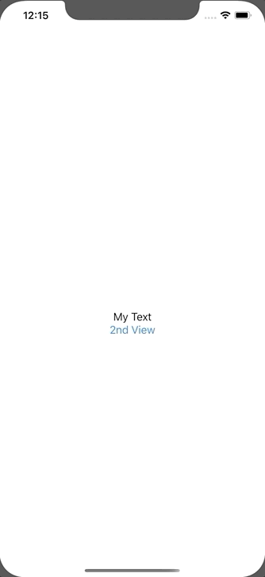

+++
title =  "Calling the transition source method from the view of the screen transition destination in SwiftUI"
url = "2020-01-11"
date = "2020-01-11"
description = "Calling the transition source method from the view of the screen transition destination in SwiftUI"
tags = [
    "Swift", "SwiftUI"
]
categories = [
    "Swift", "SwiftUI"
]
archives = "2020/01"
aliases = ["migrate-from-jekyl"]
+++

 

This is a sample that calls the transition source method from the view of the screen transition destination in SwiftUI.
I used delegate, but it might be better to write in Combine.

<!-- Google Ads -->


<!-- Amazon Ads -->



