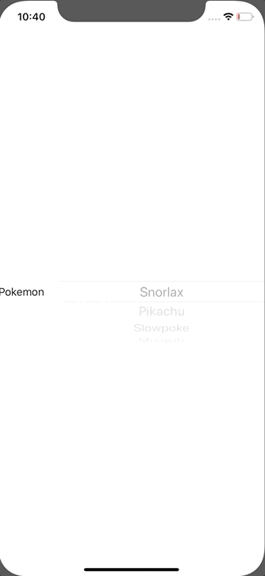

+++
title =  "Displaying a Picker in SwiftUI"
url = "2020-01-12"
date = "2020-01-12"
description = "Displaying a Picker in SwiftUI"
tags = [
    "Swift", "SwiftUI"
]
categories = [
    "Swift", "SwiftUI"
]
archives = "2020/01"
aliases = ["migrate-from-jekyl"]
+++

 

This is a sample to display the picker in SwiftUI.
In case of multiple lines, click here.
 [Creating a multi-line picker in SwiftUI](/2020-01-14/)

Reference: [Is there a way to call a function when a SwiftUI Picker selection changes?](https://stackoverflow.com/questions/58676483/is-there-a-way-to-call-a-function-when-a-swiftui-picker-selection-changes)  

<!-- Google Ads -->


<!-- Amazon Ads -->



