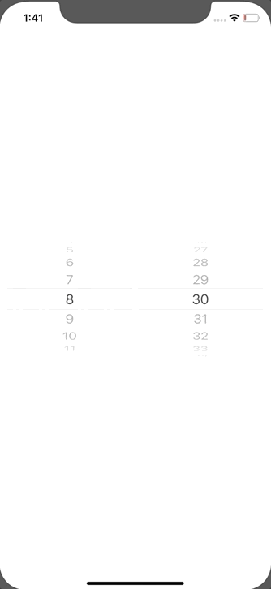

+++
title =  "Creating a multi-line picker in SwiftUI"
url = "2020-01-14"
date = "2020-01-14"
description = "Creating a multi-line picker in SwiftUI"
tags = [
    "Swift", "SwiftUI"
]
categories = [
    "Swift", "SwiftUI"
]
archives = "2020/01"
aliases = ["migrate-from-jekyl"]
+++

 

This is a way to create a multi-line picker like UIPickerView.
The usability is quite different from UIPickerView and I was puzzled.

Reference: [Multi-Component Picker (UIPickerView) in SwiftUI](https://stackoverflow.com/questions/56567539/multi-component-picker-uipickerview-in-swiftui)

<!-- Google Ads -->


<!-- Amazon Ads -->



