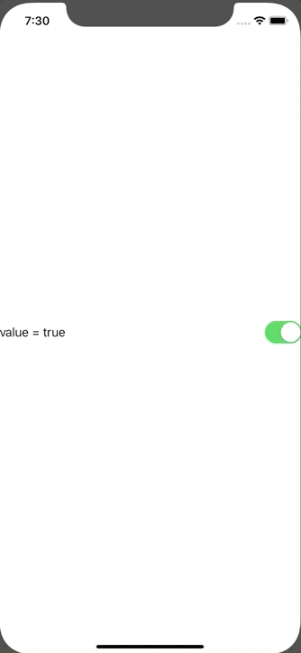

+++
title =  "Detecting changes to the SwiftUI Toggle"
url = "2020-02-05"
date = "2020-02-05"
description = "Detecting changes to the SwiftUI Toggle"
tags = [
    "Swift", "SwiftUI"
]
categories = [
    "Swift", "SwiftUI"
]
archives = "2020/02"
aliases = ["migrate-from-jekyl"]
+++

 

Detects changes to the SwiftUI toggle and executes a print statement.

Reference: [How can I trigger an action when a swiftUI toggle() is toggled?](https://stackoverflow.com/questions/56996272/how-can-i-trigger-an-action-when-a-swiftui-toggle-is-toggled)

<!-- Google Ads -->


<!-- Amazon Ads -->



