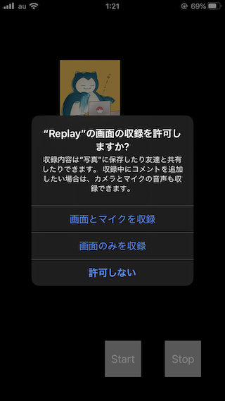

+++
title =  "Using ReplayKit to record a screen"
url = "2020-02-12"
date = "2020-02-12"
description = "Using ReplayKit to record a screen"
tags = [
    "Swift"
]
categories = [
    "Swift"
]
archives = "2020/02"
aliases = ["migrate-from-jekyl"]
+++

 

You can use ReplayKit to record your screen.
It's very easy to use, and it's also very easy to use it on the mic. and so on.
This time, I saved it as a video, but it can be used for many things, such as combining it with WebRTC.

<!-- Google Ads -->


<!-- Amazon Ads -->



