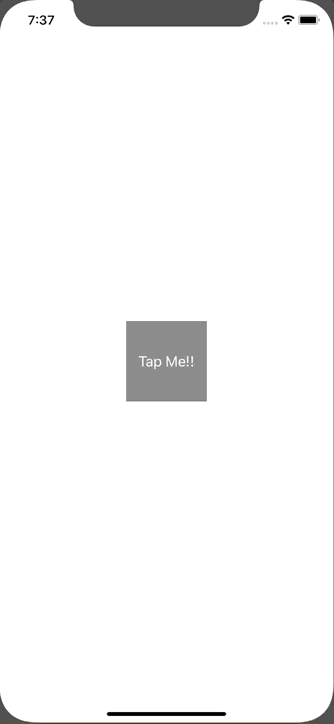

+++
title =  "Make the background of UIView a grid or a dot."
url = "2020-02-14"
date = "2020-02-14"
description = "Make the background of UIView a grid or a dot."
tags = [
    "Swift"
]
categories = [
    "Swift"
]
archives = "2020/02"
aliases = ["migrate-from-jekyl"]
+++

 

Here's how to make the UIView background a grid or a dot.
This time, I created a subclass of UIView called GridView so that the dots can be switched by pressing a button.

<!-- Google Ads -->


<!-- Amazon Ads -->



