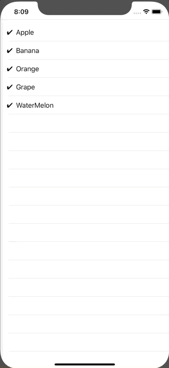

+++
title =  "Tap to check the ListView"
url = "2020-02-17"
date = "2020-02-17"
description = "Tap to check the ListView"
tags = [
    "Swift"
]
categories = [
    "Swift"
]
archives = "2020/02"
aliases = ["migrate-from-jekyl"]
+++

 

Here's a sample of tapping to check the ListView.
Tap on it to change the state and draw ✔︎.

<!-- Google Ads -->


<!-- Amazon Ads -->



