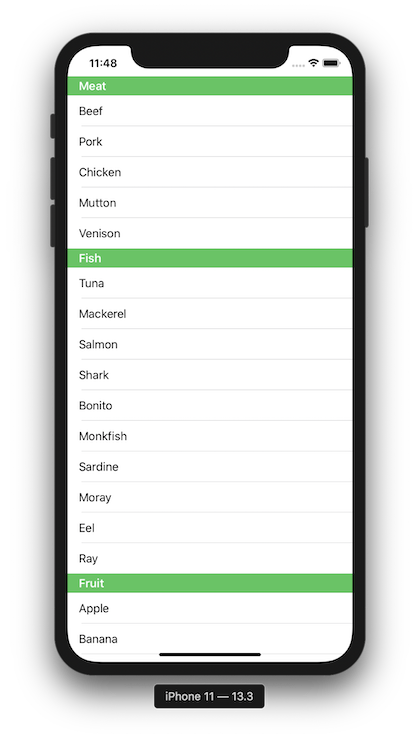

+++
title =  "Change the color of Section of List in SwiftUI"
url = "2020-02-19"
date = "2020-02-19"
description = "Change the color of Section of List in SwiftUI"
tags = [
    "Swift"
]
categories = [
    "Swift"
]
archives = "2020/02"
aliases = ["migrate-from-jekyl"]
+++

 

This is a sample to change the color of Section of List in SwiftUI.
There are some articles that use Appearance to change the background color, but I was able to do it in the following way.

[Remove/change section header background color in SwiftUI List](https://stackoverflow.com/questions/56867334/remove-change-section-header-background-color-in-swiftui-list)

<!-- Google Ads -->


<!-- Amazon Ads -->



