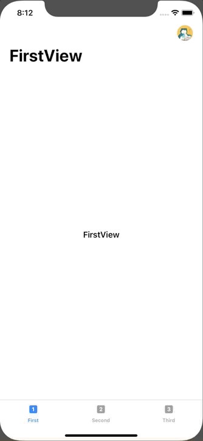

+++
title =  "Display the side menu (hamburger menu) in SwiftUI with SwiftUI."
url = "2020-02-20"
date = "2020-02-20"
description = "Display the side menu (hamburger menu) in SwiftUI with SwiftUI."
tags = [
    "Swift"
]
categories = [
    "Swift"
]
archives = "2020/02"
aliases = ["migrate-from-jekyl"]
+++

 

Sample to display the side menu (hamburger menu) in SwiftUI.
I made a few compromises, such as where I could drag it out. I'll post it again when I put on a better side menu.

[How To Create A Side Menu (Hamburger Menu) In SwiftUI](https://blckbirds.com/post/side-menu-hamburger-menu-in-swiftui/)

<!-- Google Ads -->


<!-- Amazon Ads -->



