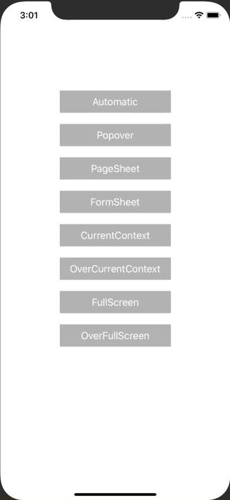

+++
title =  "I tried all the ModalPresentationStyle of iOS 13"
url = "2020-02-23"
date = "2020-02-23"
description = "I tried all the ModalPresentationStyle of iOS 13"
tags = [
    "Swift"
]
categories = [
    "Swift"
]
archives = "2020/02"
aliases = ["migrate-from-jekyl"]
+++

 

I tried all the ModalPresentationStyle of iOS 13.
Our department calls the PopPage modal a "fashionable modal".

<!-- Google Ads -->


<!-- Amazon Ads -->



