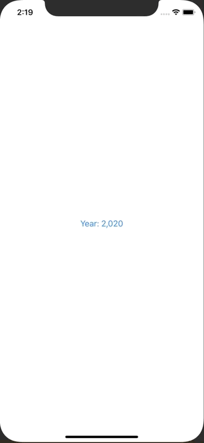

+++
title =  "Show picker from bottom with SwiftUI"
url = "2020-02-26"
date = "2020-02-26"
description = "Show picker from bottom with SwiftUI"
tags = [
    "Swift"
]
categories = [
    "Swift"
]
archives = "2020/02"
aliases = ["migrate-from-jekyl"]
+++

 

It is a way to show picker from bottom with SwiftUI.
Picker shows from bottom like a modal.

[Importing an image into SwiftUI using UIImagePickerController](https://www.hackingwithswift.com/books/ios-swiftui/importing-an-image-into-swiftui-using-uiimagepickercontroller)

<!-- Google Ads -->


<!-- Amazon Ads -->



