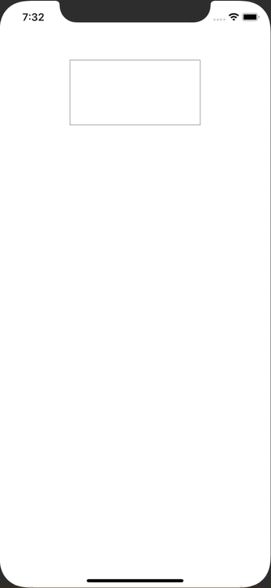

+++
title =  "Input a multi-line string with SwiftUI"
url = "2020-02-27"
date = "2020-02-27"
description = "Input a multi-line string with SwiftUI"
tags = [
    "Swift"
]
categories = [
    "Swift"
]
archives = "2020/02"
aliases = ["migrate-from-jekyl"]
+++

 

It is a way to input a multi-line string with SwiftUI.
It is implemented using TextView of UIKit.
I want Apple to release something like UITextView.

<!-- Google Ads -->


<!-- Amazon Ads -->



