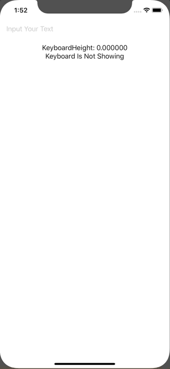

+++
title =  "Detect keyboard height and appearance with SwiftUI"
url = "2020-02-28"
date = "2020-02-28"
description = "Detect keyboard height and appearance with SwiftUI"
tags = [
    "Swift"
]
categories = [
    "Swift"
]
archives = "2020/02"
aliases = ["migrate-from-jekyl"]
+++

 

It is a way to detect keyboard height and appearance with SwiftUI.
It is implemented using Combine Frame Work.

<!-- Google Ads -->


<!-- Amazon Ads -->



