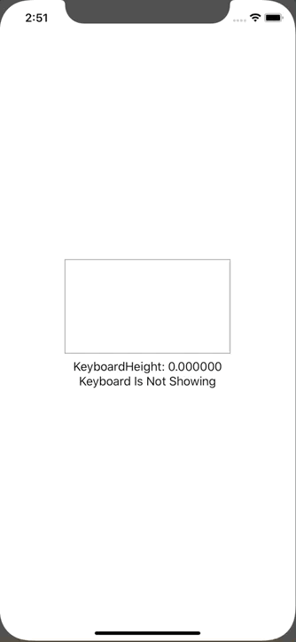

+++
title =  "Hide keyboard with buttons in SwiftUI"
url = "2020-02-29"
date = "2020-02-29"
description = "Hide keyboard with buttons in SwiftUI"
tags = [
    "Swift"
]
categories = [
    "Swift"
]
archives = "2020/02"
aliases = ["migrate-from-jekyl"]
+++

 

It is a way to hide the keyboard with a button in SwiftUI.
It is realized by extending UIApplication.

[How to lower (hide) the keyboard in SwiftUI](https://qiita.com/Riscait/items/8e76182d8b4c2def0953)

<!-- Google Ads -->


<!-- Amazon Ads -->



