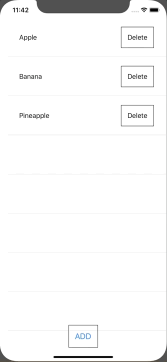

+++
title =  "Delete and add contents of List with SwiftUI"
url = "2020-03-01"
date = "2020-03-01"
description = "Delete and add contents of List with SwiftUI"
tags = [
    "Swift"
]
categories = [
    "Swift"
]
archives = "2020/03"
aliases = ["migrate-from-jekyl"]
+++

 

It is a way to add and delete contents in List in SwiftUI.
It seems bad to pass a delete function in closure.
Please let me know if there is a better way.

<!-- Google Ads -->


<!-- Amazon Ads -->



