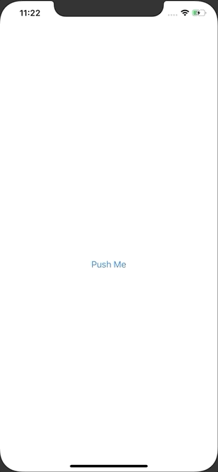

+++
title =  "Displaying a WebView in SwiftUI"
url = "2020-03-27"
date = "2020-03-27"
description = "Displaying a WebView in SwiftUI"
tags = [
    "Swift"
]
categories = [
    "Swift"
]
archives = "2020/03"
aliases = ["migrate-from-jekyl"]
+++

 

How to display a WebView in SwiftUI.
I hope they come out with a WebView that doesn't have to use UIViewRepresentable as soon as possible.

<!-- Google Ads -->


<!-- Amazon Ads -->



