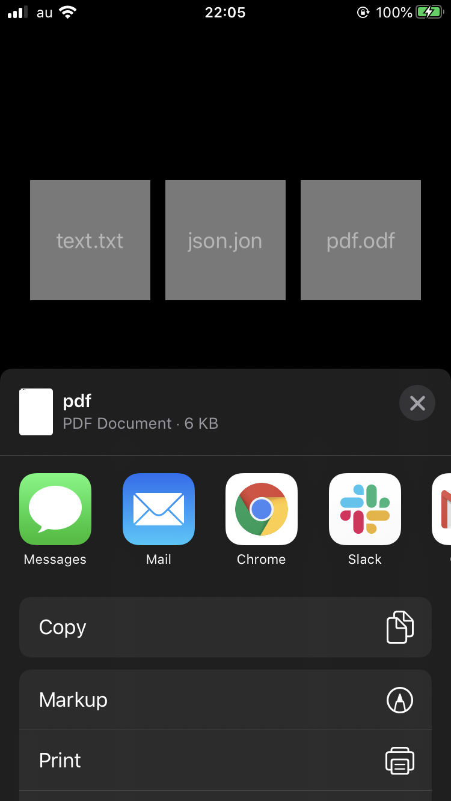

+++
title =  "Sharing Text, JSON and PDF with UIActivityViewController"
url = "2020-04-02"
date = "2020-04-02"
description = "Sharing Text, JSON and PDF with UIActivityViewController"
tags = [
    "Swift"
]
categories = [
    "Swift"
]
archives = "2020/04"
aliases = ["migrate-from-jekyl"]
+++

 
How to share Text, JSON and PDF in UIActivityViewController.
It's very useful because it's easy to share files and it's easy to implement.
Images, PDFs, etc. are recognized by passing Data, but JSON, etc. are not recognized by passing Data, so the file path is specified.

<!-- Google Ads -->


<!-- Amazon Ads -->



